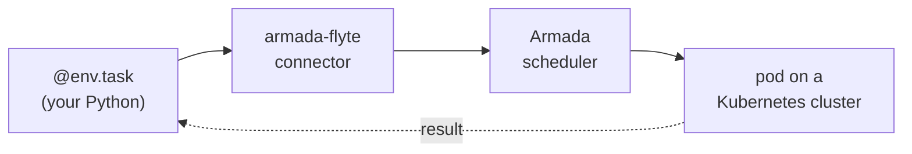

# armada-flyte

**Author in Flyte. Schedule on Armada.**

[Flyte 2](https://github.com/flyteorg/flyte) lets you write batch workflows as plain async Python.
[Armada](https://github.com/armadaproject/armada) schedules millions of jobs a day across many
Kubernetes clusters, with fair-share, gang scheduling, and preemption. `armada-flyte` connects the
two: your Flyte task runs as an Armada job, with one line of config and no new API to learn.

## The whole integration

```python
import flyte
from armada_flyte import ArmadaConfig

env = flyte.TaskEnvironment(
    name="hello",
    image="armada-flyte-task:v1",
    resources=flyte.Resources(cpu=1, memory="512Mi"),
    plugin_config=ArmadaConfig(queue="flyte"),   # this line routes the task to Armada
)

@env.task
async def greet(name: str) -> str:
    return f"hello {name}, from an Armada pod"   # runs in an Armada-scheduled pod
```

A stock `@env.task` and one `plugin_config` line. Fan out with `asyncio.gather`, pass dataclasses
between tasks, gang-schedule a group: it is all just Flyte, running on Armada.

The connector submits to the Armada at `ARMADA_URL` (default `localhost:50051`). Point it at a
remote cluster by setting that env var, or in code:

```python
import armada_flyte
armada_flyte.configure(armada_url="armada.example.com:50051")   # auth/TLS will land here too
```

The endpoint (and any future credentials) is connector config, kept out of your task code so it
never lands in the control plane. See [docs/getting-started.md](docs/getting-started.md#configuration).

## See it run

With a local Armada cluster and a Flyte backend up (a one-time setup, see
[getting started](docs/getting-started.md)), submit the task through the backend:

```console
$ ./.venv/bin/python examples/hello.py
submitted run rhjb5lr7m29wxbr6jm49
  UI: http://localhost:30080/v2/.../runs/rhjb5lr7m29wxbr6jm49
```

The run shows up in the Flyte UI, scheduled and executed by Armada. See
[getting started](docs/getting-started.md) for installing and running the connector.

## Why both

| Flyte 2 gives you | Armada gives you |
| --- | --- |
| Pure-Python DAGs with typed I/O and async fan-out | Scheduling across many Kubernetes clusters |
| The Flyte console: runs, lineage, logs | Fair-share between queues, gang scheduling, preemption |
| Local execution for fast iteration | Battle-tested at millions of jobs a day |

You keep Flyte's authoring and console; Armada does the scheduling. No rewrite, no second SDK.

## How it works



Flyte renders each task into a self-contained container.

The connector wraps that container into an Armada job, submits it, and polls until it finishes.

The connector runs as a service that a deployed Flyte backend routes to, so every run lands in the
Flyte UI.

## Next steps

Go from zero to a job in the Flyte UI:

1. **Have Armada and a Flyte backend.** The connector needs a running Armada and a Flyte 2 backend
   that routes `armada` tasks to it. [Getting started](docs/getting-started.md) covers what the
   backend needs.
2. **Write your first task.** A stock `@env.task` and one `plugin_config=ArmadaConfig(queue=...)`
   line. Start from [examples/hello.py](examples/hello.py), then browse [examples/](examples/) for
   fan-out, a full ML pipeline, and gang scheduling.
3. **Run the connector and submit.** Start the connector (`c0`), then
   `./.venv/bin/python examples/hello.py` submits the task. [Getting started](docs/getting-started.md)
   has the details.
4. **Watch it run in the Flyte UI.** The command prints a UI link. Open it to follow the run as
   Armada schedules the pod, executes it, and records the typed result.
5. **Go further.** Understand the internals in [How it works](docs/architecture.md) (the connector,
   state mapping, gang scheduling). Deploy the connector as a service for hands-off routing in
   [deploy/](deploy/).

## License

Apache-2.0. See [LICENSE](LICENSE).
